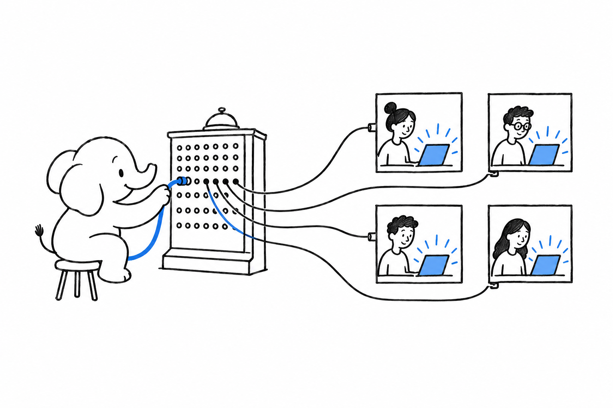

# Shipping Real-Time Features

A notification that appears on its own, a presence dot, a chat widget, a dashboard number that updates itself: the page just knows something changed, and nobody pressed refresh. PHP's request and response model does not naturally hold a connection open to push updates. **The ecosystem has closed that gap from several directions, and the choice is whether you run the push server yourself or hand that job to someone else.**

- [Laravel: Reverb and Livewire Without Writing JavaScript](ch07-01-laravel-reverb-livewire.md) pairs a first-party, self-hosted WebSocket server with a reactive component model.
- [Symfony: UX Turbo and Mercure](ch07-02-symfony-ux-turbo-mercure.md) builds on an open real-time protocol rather than a custom server.
- [Nextcloud Talk: Real-Time Built Into a Larger Platform](ch07-03-nextcloud-talk.md) is how a large PHP application handles chat and calls at scale.
- [Pusher ($): Managed WebSockets Without Running Your Own Server](ch07-04-pusher-managed-websockets.md) trades infrastructure for a subscription.
