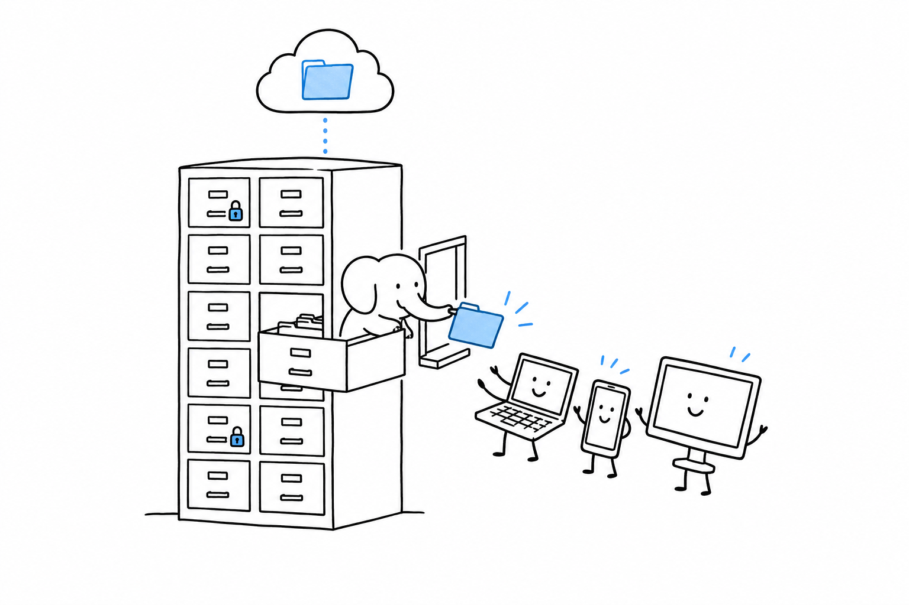

# Shipping File Storage and Collaboration

"We need our own Dropbox." Uploads, sharing links, folder permissions, version history: the request comes up more often than its scope suggests, and the honest answer is rarely to build a Dropbox. **Either a ready-made platform is the right call, or the request is really just file uploads in an existing app.**

- [Nextcloud: A Ready-Made Drive, Not a DIY Project](ch08-01-nextcloud-ready-made-drive.md) stands up a full file-sharing platform in an afternoon.
- [Laravel: Filesystem Abstraction and S3-Compatible Storage](ch08-02-laravel-filesystem-s3.md) adds uploads and storage to an application you already have.
- [WordPress: The Media Library at Scale](ch08-03-wordpress-media-library.md) is what is already built in, and what breaks first as it grows.
