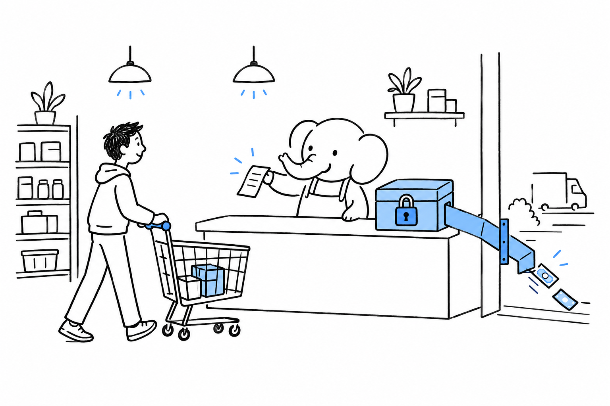

# Shipping a Storefront

Products, a cart, a checkout, and real money changing hands without a credit card number ending up somewhere it should not. Taxes, refunds, inventory, and payment compliance all carry risk when handled casually. **E-commerce is the area where "just build it yourself" is almost never the pragmatic answer.**

- [WooCommerce: E-Commerce on Top of WordPress](ch09-01-woocommerce.md) is the fastest path when the site is, or should be, WordPress.
- [Sylius: A Symfony-Based E-Commerce Framework](ch09-02-sylius.md) fits a custom storefront with business logic of its own.
- [Laravel: Cashier and Stripe ($) for Custom Checkouts](ch09-03-laravel-cashier-stripe.md) fits a Laravel app that needs a subscription or a checkout, not a store.
