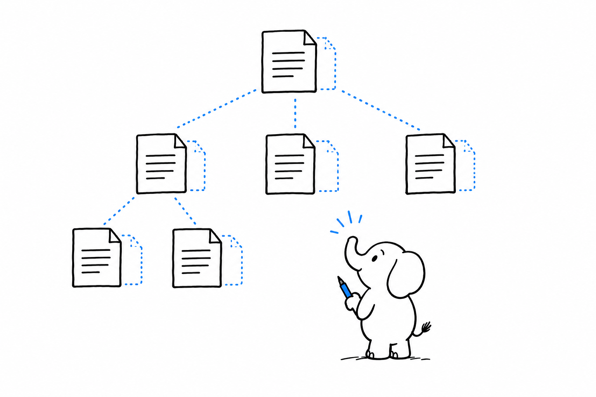

# Shipping Multi-Language, Multi-Site

One codebase, several languages, several national subsidiaries with slightly different content. The request sounds like a translation problem. **Underneath, it is a content architecture problem: how a translated page relates to its original, and who may edit what, matters more than the translation mechanism.**

- [TYPO3: Multilingual Content Trees Done Properly](ch13-01-typo3-multilingual-trees.md): a content structure built for this from the start.
- [WordPress: Multisite and WPML](ch13-02-wordpress-multisite-wpml.md): two WordPress answers to two different versions of the question.
- [Symfony: The Translation Component](ch13-03-symfony-translation-component.md): translating the application's own interface, not its content.
