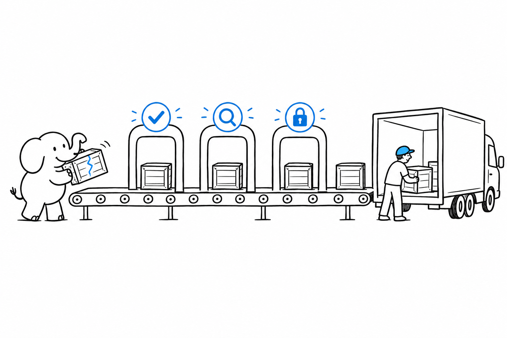

# Shipping Confidence

"It works on my machine" is not a feature. The bug your user finds at 11 p.m. was there on your machine too; nothing was looking for it. **Confidence is a feature, and it belongs in every project in this book, not only the ones with time left over.** It comes from three checks that run without you: a test suite that catches regressions, a static analyzer that catches whole classes of bugs before the code runs, and a scan that flags a vulnerable dependency before it ships.

Each ecosystem has its own set of gates. The last two pages are the ones that work everywhere.

- [Laravel: Pest, Larastan, and `composer audit`](ch14-01-laravel-pest-larastan.md): tests that read like sentences, a type checker that knows Laravel, and a vulnerability scan in one command.
- [Symfony: PHPUnit, PHPStan/Psalm, and Rector](ch14-02-symfony-phpunit-phpstan-rector.md): the same three, plus a tool that rewrites your code for the next major version.
- [WordPress: PHPUnit, PHPCS/WPCS, and WPScan](ch14-03-wordpress-phpunit-phpcs-wpscan.md): tests against a real WordPress, a linter that spots unescaped output, and a scanner for known plugin holes.
- [Cross-Ecosystem: SAST, Dependency Scanning, and CI Gates](ch14-04-cross-ecosystem-sast-ci-gates.md): what runs the same in every stack, wired so a broken build cannot merge.
- [Catching It in Production: Sentry and Flare ($)](ch14-05-sentry-flare-error-tracking.md): the moment confidence has to reach past your test suite, into what real users hit.
