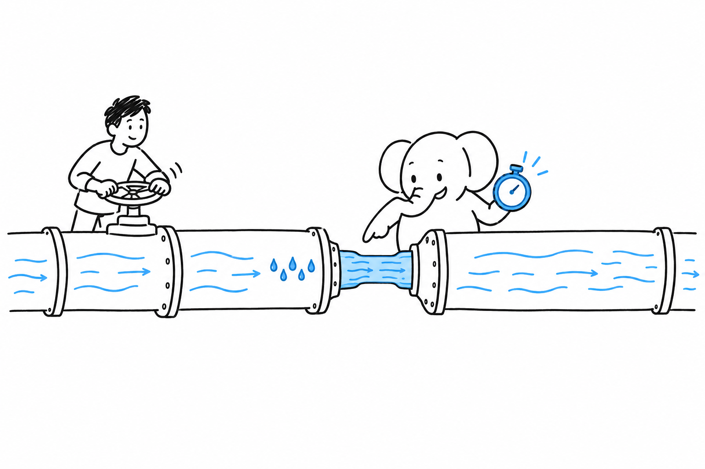

# Shipping It Fast, At Scale

Most features in this book ship fine on ordinary PHP: a fresh process per request, a database query, a response, done. Then traffic grows, or one page turns out to be slow, and "it works" quietly stops being enough. **This chapter is for the second phase, when performance has become a measured requirement rather than a worry.**

Three of the four pages are fixes. Read the fourth first: it tells you which fix you need.

- [FrankenPHP and Laravel Octane: Worker Mode Performance](ch15-01-frankenphp-laravel-octane.md): keep the application booted in memory between requests instead of rebuilding it every time.
- [TYPO3: The Built-In Caching Framework](ch15-02-typo3-caching-framework.md): a layered cache with targeted invalidation, built into a large content platform.
- [Nextcloud: Scaling a Self-Hosted Platform](ch15-03-nextcloud-scaling.md): what changes when a self-hosted PHP application grows from a team to an organization.
- [Blackfire ($): Finding the Actual Bottleneck](ch15-04-blackfire-profiling.md): measure where the time goes before you fix anything.
