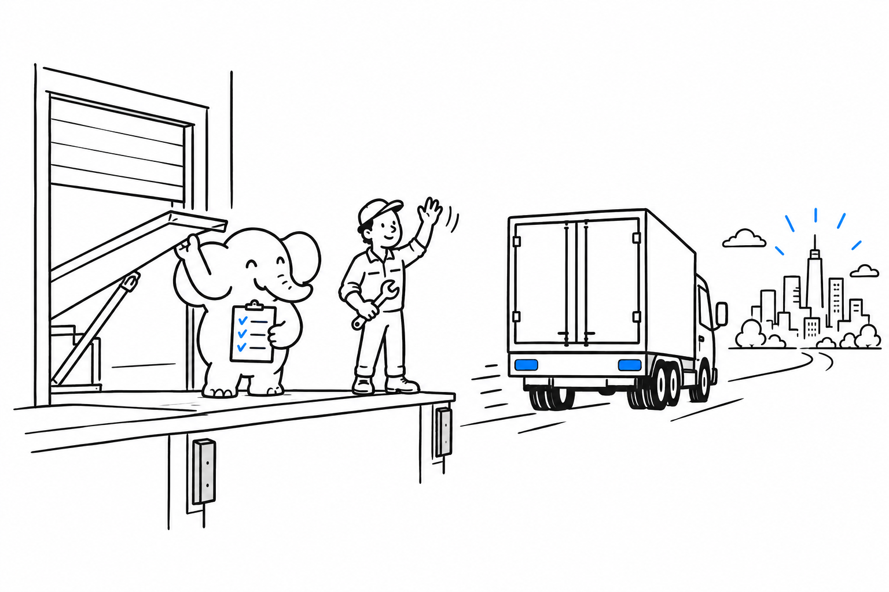

# Shipping to Production

A feature is not shipped until it is live. And "live" means someone, possibly you, is now responsible for keeping it up, keeping it patched, and surviving the traffic it gets. **This chapter is the last mile between "works locally" and "a client is using this," and it involves no new code.**

The right page depends less on your framework than on who holds the hosting contract.

- [Laravel: Forge and Vapor ($)](ch16-01-laravel-forge-vapor.md): the Laravel team's own deployment products, one for servers, one for serverless.
- [Cloud Hosting: AWS, GCP, and Azure the Pragmatic Way](ch16-02-cloud-hosting-aws-gcp-azure.md): the least-effort option on each cloud when the client already has a contract there.
- [Platform.sh ($): One Deploy Story for Several Frameworks](ch16-03-platform-sh.md): a managed platform that does not care which framework is underneath.
- [WordPress: Managed Hosting Done Right (Kinsta, WP Engine $)](ch16-04-wordpress-managed-hosting.md): hosting built around what WordPress needs.
- [Nextcloud: All-in-One Docker Deployment](ch16-05-nextcloud-aio-docker.md): the self-hosted path Nextcloud itself recommends.
