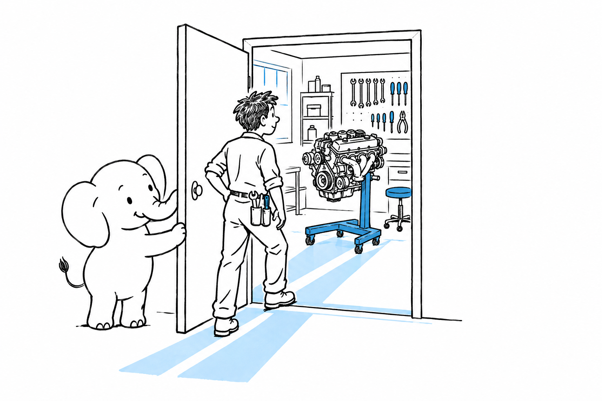

# Where to Go From There

This book covered a lot of ground without once asking you to commit to a stack for good. That was the point. **The pragmatic builder's skill is not mastering one framework; it is matching a feature to the tool that ships it fastest, again and again, across projects and clients.** This last chapter is about keeping that skill sharp once the book is closed.

- [Evaluating a New Stack in a Day](ch17-01-evaluating-a-new-stack-in-a-day.md): a repeatable way to size up a tool you have never used.
- [Communities Worth Joining](ch17-02-communities-worth-joining.md): where each ecosystem in this book gets its questions answered.
- [If You Get Curious About What's Underneath](ch17-03-if-you-get-curious.md): the door back to the language itself, for the day "just ship it" turns into "wait, how does this work?"
