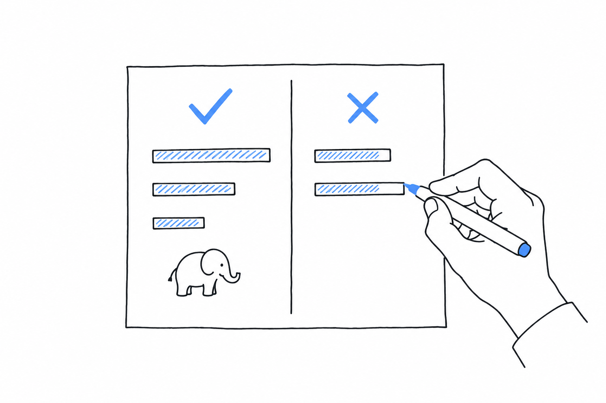

# How to Read This Book

You are being asked to take PHP seriously, and you would rather not. The language is thirty years old, it is associated with the worst code you have ever been shown, and nobody at the conferences you follow talks about it. Yet it keeps turning up: in the stack of a company you respect, on the job board, behind a site that handles more traffic than yours. I wrote this book to settle that contradiction with evidence rather than with enthusiasm.

**Every figure in this book has a source and a date, and the appendix lists them so you can check each one.** A number in the text is followed by where it comes from and when, in a short parenthesis. A vendor figure, a self-reported case study or a synthetic benchmark is labelled as such in the same sentence as the number, and when I do not know something, I say so. You should never have to wonder whether a sentence is a fact or a wish.

## Why the doubt is reasonable

The reputation was earned. For its first decade PHP was permissive to a fault: variables appeared from nowhere, `"abc" == 0` was true, errors were printed into the page and execution went on, database queries were built by string concatenation, and the standard library grew one function at a time with whatever name its author preferred that week. A generation learned to program on that PHP and wrote a great deal of it, and much of that code still runs. Most of what you have been shown as "PHP" comes from that period.

The language you would evaluate today is a different object. PHP 7 (2015) rebuilt the engine and added scalar type declarations. PHP 8 (2020) added union types, `match`, named arguments, attributes, enums, `readonly` properties, first-class callables and a JIT compiler, and made the interpreter throw where it used to guess. A release has shipped every year since, in late November or early December. The PHP Foundation has employed core developers since 2021, the package manager is universal, and two static analysers give you most of what a compiler would. The current syntax is in [The Language in 2026](ch05-the-language.md), and the people who ship it are in [Governance and Longevity](ch07-governance.md).

Some of the reputation is still deserved. Strings are byte sequences, the standard library keeps its historical names, and there are no generics, no threads in userland and a synchronous runtime by default. A large share of the PHP running on the public web is old, because the hosting that runs it is old. Each of these limits sits in the chapter where you would look for it, next to the current practice around it, and [Where PHP Is the Wrong Choice](ch09-wrong-choice.md) collects the cases where the honest advice is to pick something else.

## The questions, in order

Each chapter answers one question you would ask, in the order of a due-diligence review, from the outside in.

[Footprint](ch01-footprint.md) asks who runs on PHP and at what scale, and answers with web share data, with the platforms built on it, and with organisations that describe their PHP production in their own words. [The Runtime](ch02-runtime.md) explains the execution model, because most of what PHP does well and most of what it cannot do follow from it. [Throughput and Latency](ch03-throughput-and-latency.md) and [Concurrency](ch04-concurrency.md) give the performance figures, with the benchmark round, the hardware and the test named, and with the languages that beat PHP on the same test on the same chart.

[The Language in 2026](ch05-the-language.md) is the shortest possible tour of the syntax, for those who judge a language by reading it. [The Ecosystem](ch06-ecosystem.md) counts packages, frameworks and tools. [Governance and Longevity](ch07-governance.md) covers the RFC process, the release calendar, the security process and the money, and [Cost of Ownership](ch08-cost.md) looks at hiring, hosting and upgrades.

[Where PHP Is the Wrong Choice](ch09-wrong-choice.md) is the chapter that makes the others credible. [An Evaluation in One Week](ch10-evaluation.md) is a protocol, what to install, what to measure, what to read, so that the decision you reach rests on your own numbers and not on mine.

## The rules I follow

**Comparisons are symmetrical.** When a chart shows PHP ahead of a language on one measure, the text names a measure where that language is ahead, when one exists. The mainstream options you would expect to see, Node.js, Python, Java, C#, Go, Ruby, are never left off a chart because they would look good on it.

**Names come with evidence.** A company appears here only when its own engineers, in a blog post, a talk, a repository or a report, say it runs PHP in production, and the appendix links to that document with its date. Companies that run Hack on HHVM, a language that forked from PHP, are not presented as PHP users, however tempting the logo was.

**Frameworks and tools are listed, not recommended.** They appear in alphabetical order. The PHP Foundation, under whose umbrella this book is published, promotes the language and its standards rather than a vendor, and so do I.

## How to check it

Every chapter ends with something you can verify in an afternoon: a public dashboard to open, a benchmark to rerun on your own hardware, a command to type. Take those seriously. A figure I got wrong, or a figure that aged since I wrote it, is exactly what you should find, and [Sources](appendix-01-sources.md) gives you the URL to find it with.

Your first question is probably the one I started with too: who actually runs on this?
