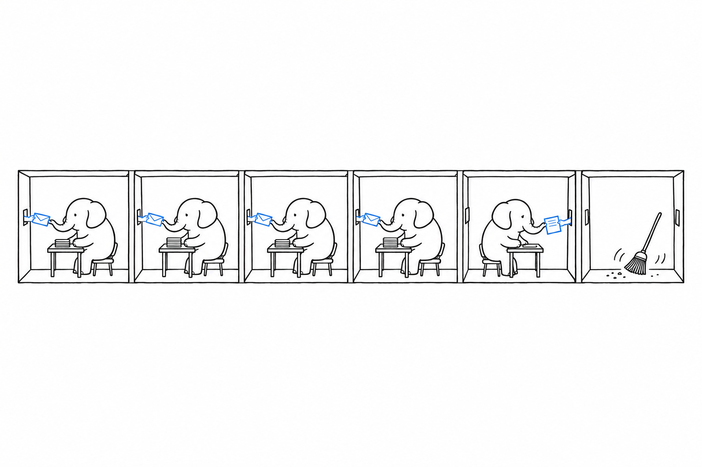

# The Runtime

Most of what PHP does well, and most of what it cannot do, follows from the way it serves a request. **A PHP request starts with nothing, runs your code from top to bottom, sends its response, and is discarded; concurrency comes from a pool of processes, each handling one request at a time.** Nothing survives from one request to the next inside the process, which is why the model is called shared-nothing: there is no application object that stays alive, no event loop and no thread.

## One request, one process

The standard deployment is PHP-FPM, the FastCGI process manager, behind a web server such as nginx, Apache or Caddy. The manager keeps a pool of worker processes, hands each incoming request to an idle worker, and the worker executes the script, writes the response and returns to the pool with its memory wiped. The pool size is a configuration line. A machine with more cores runs more workers, and more machines behind a load balancer run more pools, with no coordination between them.

A platform team notices the good side of this model first. A request that crashes, leaks memory or runs out of time takes one worker with it and nothing else; the manager replaces the worker and the other requests never see it. A memory leak cannot accumulate beyond one request, so a long-running PHP application does not degrade over days the way a long-lived process can. Deployment is a file copy followed by a cache reset, because there is no process to restart gracefully and no in-memory state to drain.

The same model has costs, and a performance engineer sees them first. Every request pays for booting the application: reading configuration, wiring dependencies, registering routes. There is no in-process cache across requests, so a lookup table computed once per process in another language is computed once per request here, or stored in shared memory through the APCu extension, or in an external cache. Database connections are opened and closed per request unless configured as persistent, so a connection pool, when needed, lives outside PHP. A workload that must hold state between requests, a WebSocket server or a game lobby, does not fit the model at all, and [Concurrency](ch04-concurrency.md) covers what fits it instead.

## OPcache, preloading and the JIT

The obvious objection to booting on every request is the cost of parsing and compiling the source every time, and PHP removed it in 2013. **OPcache keeps the compiled form of every file in shared memory, so that a file is compiled once per deployment rather than once per request**. It has been part of the standard distribution since PHP 5.5 and is enabled in the `php.ini-production` template that ships with it; a benchmark run without it measures nothing about PHP.

Preloading, added in PHP 7.4, goes one step further. A list of files is compiled and linked at manager startup and kept in memory, so that classes exist before the first request and no autoloading happens at all. The RFC that introduced it measured a 30 percent gain on one framework's hello-world page and 50 percent on another, and states in the same paragraph that real-world gains "will likely be lower" and depend on the ratio of bootstrap to actual work.

The JIT compiler, added in PHP 8.0 inside OPcache, compiles hot code paths to machine code, and its own release notes are more sober than the headlines. php.net states that the tracing JIT "shows about 3 times better performance on synthetic benchmarks and 1.5 to 2 times improvement on some specific long-running applications", and that "typical application performance is on par with PHP 7.4". The RFC's own measurement on WordPress was 326 requests per second with the JIT against 315 without. The JIT has never been on by default: before PHP 8.4 its buffer size was zero, and since 8.4 a 64-megabyte buffer is reserved but `opcache.jit` is set to `disable`, so it must be enabled explicitly. A web application gains little from it, and a CPU-bound script can gain a lot.

## Worker runtimes

The one cost that OPcache does not remove is the application boot, and a second family of runtimes removes it by keeping the application in memory. **In worker mode, a process boots the application once and then handles requests in a loop, one at a time, for thousands of requests before being recycled.** Alphabetically: FrankenPHP, an application server written in Go on top of the Caddy web server, which offers both the classic one-request-per-process mode and a worker mode; RoadRunner, an application server also written in Go, which keeps a pool of PHP workers alive and passes requests to them over a protocol; and Swoole or its fork OpenSwoole, a C extension that gives PHP its own event loop and HTTP server. FrankenPHP has been hosted under the php organisation on GitHub since 8 June 2025, with its governance unchanged.

What the switch buys depends entirely on how expensive the boot is, and the honest way to show it is on the same code with the runtime as the only variable. On a bare hello-world script, where there is no boot to skip, Tideways, a PHP profiler vendor and a founding member of The PHP Foundation with no stake in either runtime, found FrankenPHP in classic mode and PHP-FPM within half a percent of each other, at about 18,400 requests per second on an eight-core virtual machine. On a full framework, the benchmark suite that [Throughput and Latency](ch03-throughput-and-latency.md) reads in detail shows the Symfony entry moving from 26,000 requests per second under PHP-FPM to 74,000 under FrankenPHP and 111,000 under Swoole on its Fortunes test, with the framework code unchanged. Vendors and framework authors publish larger ratios on their own pages. I keep to these two figures because you can reproduce both from published material.

The price is the loss of the shared-nothing guarantee. A worker that keeps the application booted also keeps whatever the application leaked, so static properties, caches and open resources now persist between requests, and a class of bugs that PHP-FPM made impossible becomes possible again. The FrankenPHP documentation says it plainly: PHP "was not originally designed for long-running processes", and the worker mode ships with a maximum-requests counter to recycle processes as a safeguard. A team choosing worker mode takes on the discipline that Node.js or Java teams already have.

## What a process costs

You will want a baseline before any framework is added. On the machine I wrote this book on, a PHP 8.3 command-line process with no script allocates 2 megabytes for its own heap and reaches 33 megabytes of resident memory including the interpreter and its loaded extensions, and starts and exits in 20 milliseconds, measured with `memory_get_usage(true)` and `/usr/bin/time`. Reproduce those on your own hardware, and remember that a PHP-FPM worker shares the interpreter's read-only pages with its siblings, so the marginal cost of one more worker is lower than the figure suggests. Wikimedia's production configuration, published in its task tracker, runs eight PHP-FPM workers per MediaWiki container with a 500 megabyte OPcache and an APCu cache of 768 megabytes, in one to two gigabytes of memory per container.

> The limit: the shared-nothing model has no threads, no in-process shared state and no background work inside a request. Anything that must outlive a request, a connection pool, a warm cache, a scheduled job, lives in another process or another system, and the architecture around a PHP application reflects it. That is a real constraint, and it is also why the operational story is simple.

## What to verify yourself

Install PHP-FPM and a web server on a small virtual machine, enable the FPM status page, and watch the pool under a load generator such as `wrk` or `ab`: the process count, the memory per worker and the request time are all visible. Then run the same hello-world under FrankenPHP in worker mode and compare. An afternoon of this teaches you more about the runtime than I just did, and the numbers will be yours.

A throughput figure means something only once you know which of these runtimes produced it.
