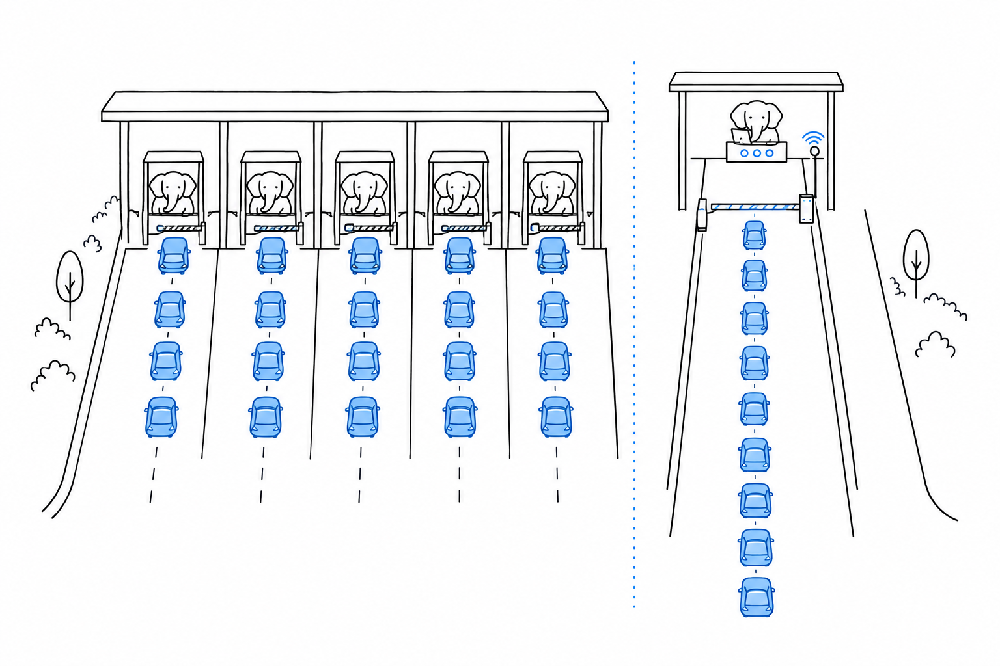

# Concurrency

Ten thousand idle connections, a hundred outbound calls to fire at once, a computation that should keep every core busy: at some point your requests stop being independent, and that is where your third question begins. **PHP has no threads in its standard build and no built-in event loop; concurrency comes from processes, from libraries built on the coroutine primitive the language added in 8.1, and from runtimes that bring their own event loop.** Each of those three fits some workloads and fails others, and the difference is what you need to know before you commit a service to it.

## Many requests

A worker waiting 40 milliseconds on a query holds one process for 40 milliseconds, and no other request notices. That is the whole model for the ordinary case of many independent HTTP requests: the process pool of [The Runtime](ch02-runtime.md), where each worker blocks on its database call, its cache lookup and its outbound HTTP request while the operating system schedules the other workers around it. An event-loop runtime such as Node.js needs asynchronous code so that one slow call does not freeze every connection. PHP gave each connection its own process instead, and the code stays synchronous.

The bill for that simplicity is memory per idle connection. A worker holding a WebSocket open, waiting on a long poll or streaming a response for a minute occupies a whole process for the duration, and a pool of a few hundred processes cannot hold ten thousand idle connections. For that workload PHP's default model is the wrong one.

## Many connections

**For workloads that need many concurrent connections in one process, PHP has async runtimes, and they are libraries or extensions rather than language features.** Alphabetically, they are AMPHP, a set of non-blocking libraries built on an event loop and on the language's fibers; ReactPHP, a low-level event-driven library set with its own event loop, HTTP server and stream components; and Swoole or its fork OpenSwoole, a C extension that gives PHP an event loop, coroutines and a built-in HTTP and WebSocket server, with I/O calls that yield instead of blocking. FrankenPHP and RoadRunner, the worker runtimes of [The Runtime](ch02-runtime.md), are not on that list because they answer a different need: they keep the application booted between requests, still one request at a time per worker, and do not make code concurrent.

Under the first two sits the Fiber, added in PHP 8.1: a function that can suspend itself and be resumed later by whoever holds it. The RFC that introduced fibers is precise about what they are not: "all fibers exist within a single thread, only a single fiber may execute at a time", and "blocking code, such as `file_get_contents()`, will continue to block the entire process, even if other fibers exist". The language ships no scheduler; a library provides one, and every I/O call in the program has to go through that library to yield. An async PHP application is therefore written against AMPHP's or ReactPHP's HTTP client, database client and filesystem functions rather than the standard ones. One synchronous library pulled in by mistake blocks the whole loop.

How far an event loop carries PHP shows in the cross-language benchmark's plaintext test, which does no application work at all and measures only how many pipelined connections an HTTP layer can serve.

{{#include charts/ch04-techempower-plaintext.svg}}

The Swoole entry serves 3.5 million requests per second, ahead of Micronaut, Gin, Node.js and Spring, while plain PHP under PHP-FPM serves 450,000 and Laravel under PHP-FPM 27,000. The ceiling is elsewhere: ASP.NET Core at 11.5 million, and at the top a C-backed Python server and a Rust server at about 28 million. With an event loop PHP sits in the second group, not the first; without one it sits in the fourth.

## Many cores

The fastest PHP spectral-norm program in the Benchmarks Game finishes in 18 seconds of wall time while using 72 seconds of CPU across cores, against 90 seconds for the fastest Python program and 1.6 seconds for Node.js. That gap between CPU time and wall time is what parallel computation looks like in PHP, and once again it comes from processes. The command-line interpreter forks with `pcntl_fork()`, starts subprocesses with `proc_open()` or runs several scripts under a supervisor, and the results come back through pipes, files, a database or a queue. The `parallel` extension offers threads on the thread-safe build of the interpreter, which few distributions ship. Fork-based parallelism works, and it works inside the interpreter's speed class described in [Throughput and Latency](ch03-throughput-and-latency.md).

Whether the scheduler will ever move into the engine is an open question on the internals list. An RFC titled "Concurrency Support in the PHP Engine", which would add a scheduler and structured concurrency to the language itself, was under discussion there at the time of writing, with no vote held, after an earlier proposal on the same subject was cancelled in July 2026. As I write, in September 2026, the language has fibers and the scheduler is a library.

## Work that outlives the request

Most of the concurrency you will actually need is the kind the user should not wait for. A request has a time limit and a response to send, so anything that takes longer has to leave the request. **The idiom is a queue and a worker process.** The request writes a job to a table or a message broker and returns; a command-line PHP script, kept alive by a process supervisor, loops over the queue and runs the jobs one after another. That script has no time limit and no memory limit unless you configure them, so a production worker sets both and exits cleanly after a few thousand jobs, letting the supervisor start a fresh process. Most full-stack frameworks ship the pattern with a driver for the usual brokers, and cron covers the scheduled case.

> The limit: PHP's concurrency is coarse. Processes for requests, processes for cores, a queue for background work, and a separate runtime with its own I/O libraries for the connection-heavy case. If your product is a real-time service with tens of thousands of open connections, you will spend your first month choosing and learning one of the async runtimes, and you will find that most of the ecosystem's libraries were not written for it. If your product is request and response, you will not meet the question.

## What to verify yourself

Take the connection-heavy scenario you actually have, if you have one, and write it twice in an afternoon: once with AMPHP or ReactPHP, once with Swoole or OpenSwoole. Then check how many of the libraries you would depend on offer a non-blocking client. If the answer is most of them, the async path is open to you; if it is few, the honest conclusion is that PHP is the wrong tool for that one service, and the rest of your system is a separate decision.

Whether the language itself is one you would want to write is a different question, and you answer it by reading it.
