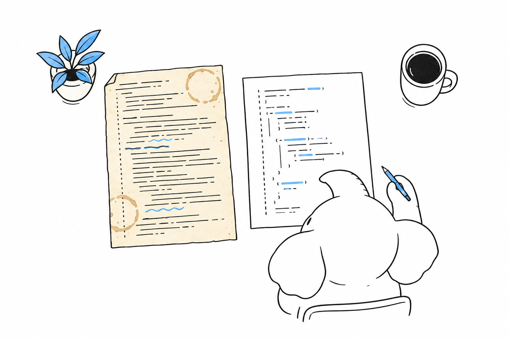

# The Language in 2026

Is this a language you would want to write for a few years? No benchmark answers that; you answer it by reading code. **PHP today is an object-oriented, garbage-collected language with declared types enforced at runtime at function and property boundaries, with enums, immutability, closures, attributes and a package manager.** One example is enough to judge it, and every construct younger than 2022 carries the version that introduced it, so you know what a given project can use.

## One complete example

```php
<?php
declare(strict_types=1);

enum Status: string
{
    case Draft = 'draft';
    case Published = 'published';
    case Archived = 'archived';

    public function isVisible(): bool
    {
        return $this === self::Published;
    }
}

final readonly class Article
{
    public function __construct(
        public string $title,
        public Status $status,
        public ?\DateTimeImmutable $publishedAt = null,
    ) {
    }

    public function publish(\DateTimeImmutable $at): static
    {
        return new static($this->title, Status::Published, $at);
    }
}

function summary(Article ...$articles): string
{
    $visible = array_filter($articles, fn (Article $a): bool => $a->status->isVisible());
    $titles = array_map(fn (Article $a): string => $a->title, $visible);

    return match (count($titles)) {
        0 => 'nothing published',
        1 => $titles[array_key_first($titles)],
        default => implode(', ', $titles),
    };
}

$draft = new Article(title: 'Benchmarks', status: Status::Draft);
$live = $draft->publish(new \DateTimeImmutable('2026-09-01'));

echo summary($draft, $live), PHP_EOL;   // Benchmarks
echo $draft->status->value, PHP_EOL;    // draft
```

Read it the way you would read a pull request. `declare(strict_types=1)` switches the file to strict typing, so a string passed where an `int` is declared throws a `TypeError` instead of being converted; the switch works per file, and a project turns it on in every one. The `enum` is a real enumeration, a closed set of singleton objects that can carry methods and a backing value. The `readonly` class (PHP 8.2) makes every property immutable after construction, and its constructor declares and assigns those properties in one place.

The rest of the syntax you already know from elsewhere: named arguments at the call site, `?` for nullable types, `static` as a return type, `fn` for one-line closures, and a `match` that compares strictly, never falls through and throws when no arm matches.

What the example does not show matters as much. Every boundary in it is typed, though the language does not require that; a read of an undefined variable is a warning in PHP 8, and the static analysers turn it into an error. The `$` sigil on variables and the `->` arrow for member access are the two pieces of syntax that look foreign to everyone else, and they stop being visible after an hour.

## The recent additions

The last two releases changed how code is written, and a project on PHP 8.4 or later will use what they added.

```php
// PHP 8.4
final class Money
{
    public function __construct(
        public private(set) int $cents,
        public string $currency,
    ) {
    }

    public string $formatted {
        get => number_format($this->cents / 100, 2) . ' ' . $this->currency;
    }
}

$price = new Money(1999, 'EUR');
echo $price->formatted, PHP_EOL;     // 19.99 EUR
$price->cents = 5;                   // Error: Cannot modify private(set) property Money::$cents
```

`public private(set)` is asymmetric visibility (PHP 8.4): the property is read from anywhere and written only from inside the class, which removes most of the getters a Java or C# developer expects to write. The `get` block under `$formatted` is a property hook (PHP 8.4), logic attached to a property without changing its call sites, and that removes most of the rest. The pipe operator (PHP 8.5) chains functions left to right:

```php
// PHP 8.5
$slug = '  Hello, World  '
    |> trim(...)
    |> strtolower(...)
    |> (fn (string $s): string => preg_replace('/[^a-z0-9]+/', '-', $s))
    |> (fn (string $s): string => trim($s, '-'));

echo $slug, PHP_EOL;   // hello-world
```

The `trim(...)` form is a first-class callable (PHP 8.1), a reference to a function as a value, with the arity checked by the engine. Add attributes, structured metadata read by reflection and used by every framework for routing, validation and mapping, and you have the constructs you will meet most in a codebase started after 2024.



## What the type system does and does not do

**Types are declared on parameters, return values, properties and class constants, and the engine enforces them at runtime.** Union types (`int|string`), intersection types (`Countable&Traversable`), nullable types, `never`, `mixed` and enums are all part of the language. A type error is an exception, not a warning, and in strict mode there is no implicit coercion between scalars, except the widening of an `int` into a `float`.

You should hear what is missing from me now rather than discover it in week three. **There are no generics in the language.** A `list<Order>` cannot be expressed in a signature; the parameter is `array`. The ecosystem answers with a docblock syntax that both static analysers, PHPStan and Psalm, understand and enforce. `@param list<Order> $orders` is checked at analysis time, in the editor and in continuous integration, along with template types, conditional types and shape types richer than anything the language itself can express, so a typed PHP project runs an analyser at its strictest level on every build and treats its output as compiler errors. Whether that is an acceptable substitute for language-level generics is your call, against your own habits. It is a substitute, and you should weigh it as one.

The other absence comes from the runtime rather than the language: no threads in userland and no built-in event loop. [Concurrency](ch04-concurrency.md) describes what exists instead.

## The standard library

`strpos` sits next to `str_replace`, `array_key_exists` next to `in_array`, and some functions take the needle first while others take the haystack. That inconsistency is historical, it is real, and it is not going away. Since PHP 8.0 new functions follow one naming scheme (`str_contains`, `array_is_list`, `array_find`), internal functions throw `TypeError` and `ValueError` on bad input instead of returning `false`, and every editor with a PHP language server completes the names, which is how a team lives with the rest. The second wart is that strings are byte sequences: `strlen('é')` is 2, and text handling goes through the `mb_` family. Those are the two you will meet first.

> The limit: PHP's type system is enforced at runtime and at the boundaries of functions and properties, not inside expressions and not across generic containers. A team that wants compile-time guarantees over collections gets them from a static analyser, not from the language.

## What to verify yourself

Install PHP 8.5 (your package manager, or the official Docker image `php:8.5-cli`), paste the first example into a file and run it with `php file.php`. Then break it: pass a string where the `Status` enum is expected, remove `strict_types`, write a `match` over the enum and leave a case out, then call it with that case. The error messages are the part of a language you live with, and five minutes are enough to judge them. For the type system, run PHPStan or Psalm at its strictest level on any open-source PHP project of a size you care about, and read the first twenty findings; they show you what the analyser catches that the engine does not.
