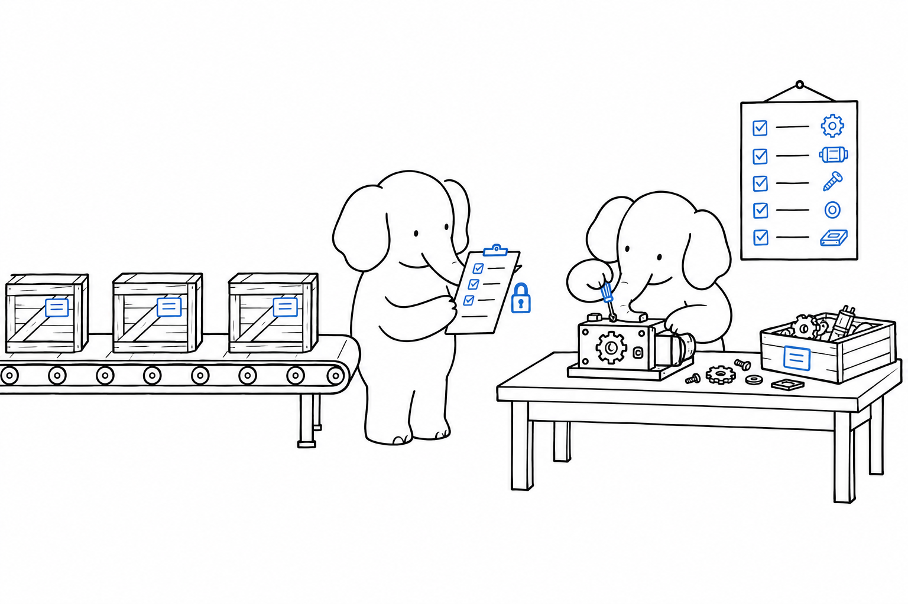

# The Ecosystem

Nobody adopts a language on its own; you adopt its libraries, its tools and its conventions with it, and your question is whether PHP's hold up against what npm, pip or Maven give you elsewhere. **PHP has one package manager, one public registry, an interoperability body that publishes standards rather than products, and at least two mature options in every tooling category, none of which the language itself endorses.** Size and activity can be measured, and the figures are here; quality is something I can only point you at.

## Composer and Packagist

Composer is the dependency manager, and there is no second one. It reads a `composer.json`, resolves versions against semantic versioning constraints, writes a `composer.lock` that pins every transitive dependency, and generates the autoloader that maps class names to files under the PSR-4 standard. Packagist, its default registry, listed 468,099 packages and 5.8 million package versions on 17 September 2026, and had recorded 199.6 billion package installs since April 2012.

{{#include charts/ch06-packagist-installs.svg}}

Installs through Composer grew from 2.0 billion in 2016 to 36.0 billion in 2025, and August 2026 alone recorded 4.9 billion, 91 percent more than August 2025. That is the activity signal, and its definition carries a caveat: an install is one package installed by Composer and reported to the registry, so continuous integration pipelines and container image builds account for a large and unknown share of it. The curve says that PHP projects are built, tested and deployed in growing numbers. It does not count projects, and you cannot set one registry's package count against another's either, because what counts as a "package" differs between ecosystems.

Since Composer 2.4, released in August 2022, `composer audit` checks every installed package against the security advisories that Packagist serves through its API, and fails the build when it finds a known vulnerability, an abandoned package or a package flagged as malware. The advisories come from the ecosystem's shared database, which held 1,649 of them in September 2026. Extensions written in C, which Composer never handled, gained an installer of their own in 2025 and 2026: PIE, the PHP Installer for Extensions, funded by a public grant and hosted under the php organisation.

## Frameworks and platforms

The full-stack frameworks in active development are CakePHP, Laminas, Laravel, Symfony and Yii; the micro-frameworks, Mezzio and Slim; the content platforms, Drupal, Joomla, TYPO3 and WordPress; the commerce platforms, Adobe Commerce with its Magento Open Source edition, PrestaShop, Shopware, Sylius and WooCommerce. The order is alphabetical throughout, and I recommend none of them.

How they relate to each other can be said with a source. Symfony publishes the list of projects built on its components, and it includes Drupal, Joomla, TYPO3, Magento, PrestaShop, Shopware and Sylius, as well as Composer itself. Those components, and Laravel's, are what you meet under most of the platforms of [Footprint](ch01-footprint.md) other than WordPress, and that is why the ecosystem is less fragmented than a list of names suggests. The usage figures come from a survey: among developers who name PHP as their main language, 64 percent reported using Laravel, 25 percent WordPress and 23 percent Symfony, with several answers allowed. The sample leans toward the vendor's customers, so read those as survey responses, not as a ranking I endorse.

## Tooling

Every category has at least two maintained options, and an afternoon with each is the way to pick. For tests, Pest and PHPUnit. For static analysis, PHPStan and Psalm, both of which read a docblock type syntax richer than the language and enforce the generics, shapes and conditional types that the engine cannot. For code style, PHP-CS-Fixer and PHP_CodeSniffer, both able to enforce the PER Coding Style standard. For editing, PhpStorm and VS Code with a PHP extension, each with a language server; for serving, FrankenPHP, PHP-FPM behind a web server and RoadRunner. Two tools stand alone: Xdebug, the debugger, which also profiles, and Rector, which rewrites code to newer syntax and is how a large codebase moves across PHP versions.

How much of that tooling gets used is another matter, and the survey figure on it is the least flattering one in this chapter.

{{#include charts/ch06-tooling-adoption.svg}}

Half of the PHP developers in the JetBrains sample use PHPUnit, a third use PHPStan, and a third write no tests at all; 42 percent use no code quality tool regularly. Whether that is worse than in other ecosystems the survey does not say, and I will not guess. The tooling exists; whether it gets used is a property of the team, not of the language.

## Standards

A library that types its logger as `Psr\Log\LoggerInterface` works under any framework, and that is what the PHP Framework Interoperability Group, PHP-FIG, exists for. It publishes the standards that let libraries from different authors fit together: 14 accepted PHP Standards Recommendations as of September 2026, covering autoloading (PSR-4), logging (PSR-3), HTTP messages and handlers (PSR-7, 15, 17), caching (PSR-6, 16), containers (PSR-11), events (PSR-14) and clocks (PSR-20), plus the PER Coding Style, at version 3.1, which replaced PSR-12 as the coding standard.

The language's own distribution is the last piece. php.net has published source tarballs signed by the release managers since 2012, with their checksums; the official Docker images `php:8.5-cli` and `php:8.5-fpm` track each release; and the mainstream Linux distributions package a version they patch themselves, which is not always one php.net still supports.

> The limit: the ecosystem is a web ecosystem. Its depth in HTTP, templating, ORMs, queues, payment and content is not matched in numerical computing, machine learning, data pipelines or desktop and mobile applications, where the packages are few and the community small. If your product needs those, you will use another language for that part, and [Where PHP Is the Wrong Choice](ch09-wrong-choice.md) says so at length.

## What to verify yourself

Run `composer create-project` with the skeleton of any framework of your choice, then `composer audit`, and read the lock file it produced; the whole supply chain is in front of you in ten minutes. Then search Packagist for the three libraries your project cannot live without, and check the date of their last release and the number of their open issues. That check tells you more than the package count does.

Under all of it sits an interpreter, and who maintains that is a question of its own.
