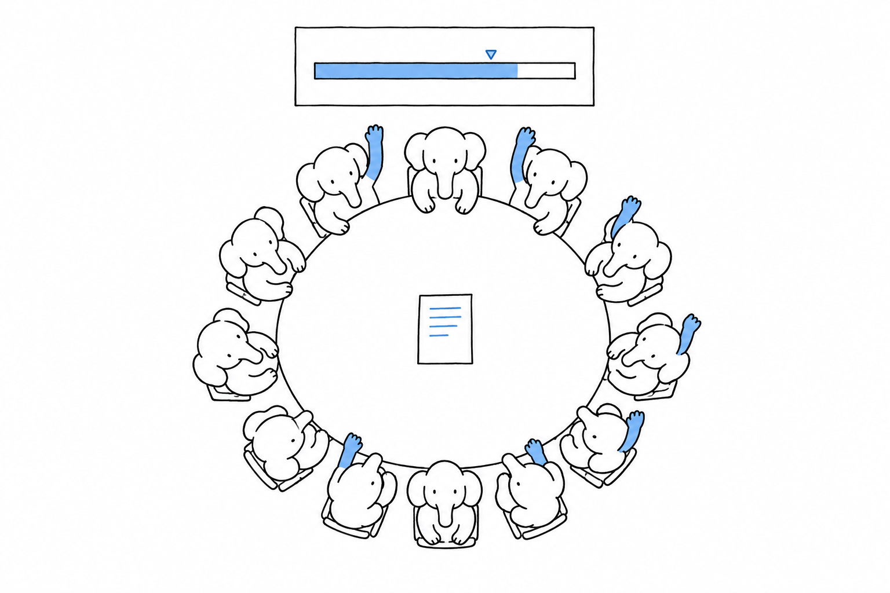

# Governance and Longevity

Before you bet a codebase on anything, you want to know who decides what goes into it, who is paid to maintain it, and how long a version stays supported. **PHP changes through a public RFC process with a two-thirds vote, ships one minor version every year and supports each for four, and since 2021 has a foundation that contracts thirteen engineers and authored 42 percent of the interpreter's commits in 2025.** The money behind that foundation is under one million dollars a year, and that figure is as much part of the answer as the rest.

## How a change gets in

Every change to the language goes through a Request for Comments on wiki.php.net. The proposal is written down, discussed for at least two weeks on the internals mailing list, then put to a vote open for at least two weeks, and it passes only with two thirds of the votes cast; the voters are contributors with a php.net account and a small number of community representatives, and the two-thirds rule has been strict since February 2019. Every step is public, down to the votes cast by name.

Nullable intersection types were rejected 12 to 26 in 2021. Auto-capturing multi-statement closures won a majority of 27 to 16 in 2022 and were declined all the same, for missing the two-thirds bar. Asymmetric visibility was declined 14 to 12 in January 2023, revised, accepted 24 to 7 in August 2024 and shipped in PHP 8.4, and nested classes were declined 2 to 20 in May 2025. That list of refusals is the evidence that the process is real.

The pace comes from a secondary index: 31 RFCs for PHP 8.4, 19 for PHP 8.5, and 29 already listed for PHP 8.6 in September 2026. If you come from a language steered by a single vendor or a benevolent dictator, weigh what this means: nothing enters PHP because someone important wants it, and features that a majority wanted have been refused. The process is slow, and it is public.

## The release calendar

**Since December 2015 PHP has shipped one minor version every year, eleven in a row, each between the 20 November and the 8 December**. Each branch then gets two years of active support, with bug and security fixes in monthly point releases, followed by two years of security fixes only. Since an RFC voted in April 2024, both windows end on 31 December of their final year, so you can plan upgrades by calendar year.

{{#include charts/ch07-support-timeline.svg}}

In September 2026, four branches are supported: PHP 8.2 in security support until 31 December 2026, 8.3 until the end of 2027, 8.4 in active support until the end of 2026, and 8.5 in active support until the end of 2027. PHP 8.6 is scheduled for general availability on 19 November 2026, with its feature freeze in August, release candidates from 24 September and three named release managers. No date exists for a PHP 9.0, and I give none. [PHP Versions, 2015 to 2026](appendix-02-versions.md) lists every release with its dates.

Behind the calendar, the repository shows the activity. In the twelve months to 17 September 2026, the main branch of php-src received 5,316 commits from 171 distinct authors, and the repository counts 1,644 contributors across a GitHub history that begins in 2011.

## Who is paid

Until 2021 the interpreter was maintained by volunteers and by a handful of engineers employed by companies with a stake in PHP. In November 2021, when one of the most active core developers announced a move away from core work, ten companies created The PHP Foundation to fund core development directly: Acquia, Automattic, Craft CMS, JetBrains, Laravel, PrestaShop, Private Packagist, Symfony, Tideways and Zend by Perforce. The foundation is hosted fiscally by Open Source Collective, lists every transaction on its Open Collective page and publishes a yearly transparency report.

{{#include charts/ch07-foundation-funding.svg}}

Contributions were 712,000 dollars in 2022, 419,000 in 2023, 684,000 in 2024 and 731,000 in 2025. Spending on engineers rose from 275,000 dollars in 2023 to 635,000 in 2024 and 784,000 in 2025, a year the foundation closed with a deficit it describes as deliberate. That is the scale, and the reports give it themselves.

What the money buys, in September 2026, is thirteen full-time and part-time engineers under contract, an executive director and a board of ten unpaid members; those engineers authored 42 percent of the commits to php-src and 32 percent of the merged pull requests in 2025. Two public grants add to the sponsors' money. The German Sovereign Tech Agency funded 205,000 euros of work in 2023 and 2024 and 223,680 euros in 2025 and 2026, and a grant from Alpha-Omega, a Linux Foundation project, has funded an ecosystem security team since May 2026.

The dependence is in the same reports. Two sponsors, Automattic and JetBrains, account for 762,500 and 476,670 dollars respectively of the 3.37 million dollars recorded on the foundation's Open Collective page since November 2021, about 37 percent between them; that running total and the yearly reports do not use the same scope, and I have not reconciled them. The number of sponsoring organisations and individuals fell from 658 in 2024 to 536 in 2025, which the foundation itself calls "substantially fewer". A budget under a million dollars is small for a language with the footprint described in [Footprint](ch01-footprint.md): it pays for a dozen engineers, not for a research group. The foundation publishes every one of those figures itself.

## Security

A vulnerability reaches the project through GitHub's private advisory workflow on the php-src repository or by email to the security team. A published policy classifies it as high, medium or low severity, and the two higher classes are fixed in a private repository before a coordinated release. Release tags have been signed by the release managers since April 2012, and every tarball ships with a detached signature and a published checksum. I found no software bill of materials and no build attestation for the release tarballs, and I report that as "not found" rather than "does not exist".

{{#include charts/ch07-cves.svg}}

The interpreter had 8 vulnerabilities published in 2022, 7 in 2023, 18 in 2024, 13 in 2025 and 14 in 2026 up to 17 September. The 2024 rise coincides with an external audit of the interpreter, commissioned with public money, which found 27 issues of which 17 had security implications, three of them high, and produced several of that year's CVEs. The chart is easy to misread. PHP's own policy assigns no CVE to most low-severity issues, so the count reflects the policy as much as the code. Nor can a count of vulnerabilities be compared between languages: what counts as "the language", a runtime, a standard library, a package registry, differs in each, and so does the disclosure policy.

> The limit: the language is governed by its contributors, funded by a foundation with a budget under a million dollars a year and two dominant sponsors, and secured by a small team and a policy that assigns fewer CVEs than some others would. Those are the facts of a community project, and they are published by the project itself; if you compare them with a language backed by a large vendor's payroll, compare the risks on both sides, including the vendor's freedom to change course.

## What to verify yourself

Open wiki.php.net/rfc and read one RFC currently under vote, then the internals mailing list thread behind it; an hour there shows how decisions are made better than any description. Open the foundation's Open Collective page, where every contribution and every expense is listed by date. Open the php-src security advisories on GitHub and read the most recent three, including the time from report to fix.

What all of this costs you, in salaries, hosting and upgrades, is the next question.
