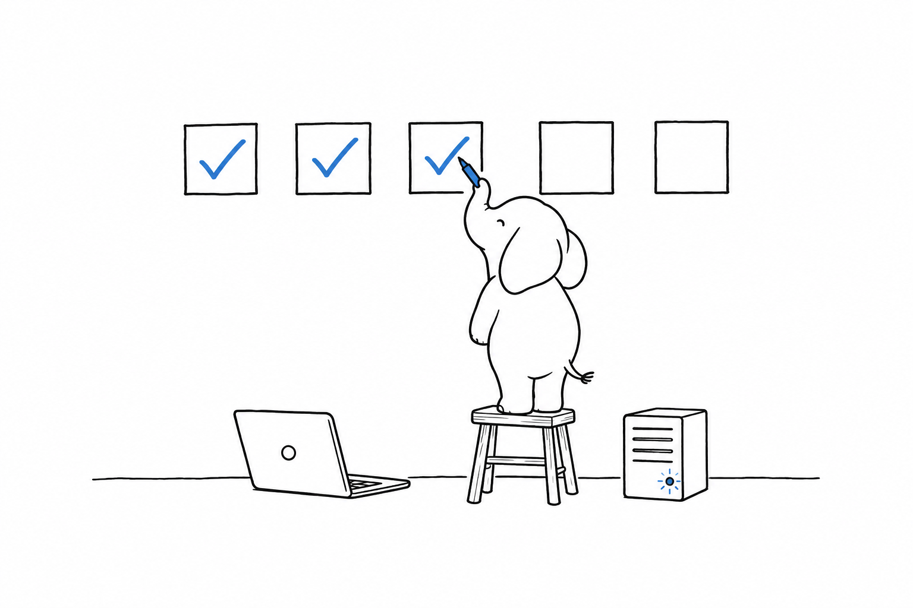

# An Evaluation in One Week

Nothing I wrote should be the reason for your decision. The reason should be a measurement you made on your own workload, and it does not take long to make one. **Five working days are enough to install the language, read it, run it under load, build a slice of your product, and check the ecosystem and the governance for yourself.** You need a laptop, a small virtual machine and nobody else, and what you hold at the end is a page of numbers that nobody handed you.

## Day one: the language

Install PHP 8.5 from your package manager or run the official image, `php:8.5-cli`. Paste the first example of [The Language in 2026](ch05-the-language.md) into a file, run it, then break it in the ways that chapter suggests and read every error message. Clone one open-source PHP project of a size you care about and run its test suite. Then run a static analyser, PHPStan or Psalm, at its strictest level and read the first twenty findings:

```bash
composer require --dev phpstan/phpstan
vendor/bin/phpstan analyse --level=max src

composer require --dev vimeo/psalm
vendor/bin/psalm --init src 1 && vendor/bin/psalm
```

What the analyser catches and the engine does not is the practical answer to the question of generics. Record the time it took you to read the codebase, and whether the findings were things you would want caught.

## Day two: the runtime

On the virtual machine, install PHP-FPM with nginx, enable OPcache, and serve a hello-world script. Then serve the same script under FrankenPHP in worker mode, and load both with the same tool at the same concurrency:

```bash
wrk -t4 -c64 -d30s --latency http://127.0.0.1/
```

Record for each run the requests per second, the median latency, the 99th percentile, and the memory per worker from the FPM status page or from `ps`. Then replace the hello-world with the skeleton of a full-stack framework, any of CakePHP, Laminas, Laravel, Symfony or Yii, and repeat. The ratio between the four runs is the runtime cost of your future application on your hardware, the figure that [Throughput and Latency](ch03-throughput-and-latency.md) could only give you for someone else's.

## Day three: a slice of the product

Pick the one feature of your product that best represents it: an authenticated endpoint that reads and writes a database, renders or serialises something, and sends one message to a queue. Build it in the framework you chose on day two, with tests, using only what the framework and Packagist provide, and do not optimise. Record how long it took, how much of it you wrote and how much you configured, how many packages it pulled in, and what `composer audit` said about them.



## Day four: the slice under load

Load the slice from day three the way you loaded the hello-world, at the concurrency you expect in production and at ten times that. Profile one slow request with Xdebug's profiler or with `hrtime()` around the suspect calls and see where the time goes; on most slices it is in the database, and the language is a small slice at each end. Record the throughput and the 99th percentile at both concurrencies, and the share of a request spent outside PHP.

Then do the one thing benchmarks never do. Kill a worker mid-request, fill the memory limit, throw an uncaught exception in a queue job, and record what the user saw, what the logs said, and what recovered by itself.

## Day five: the ecosystem and the governance

Search Packagist for the three libraries your product cannot live without, and record the date of each one's last release and its open issue count. Open wiki.php.net/rfc and read the RFC currently under vote, then the internals thread behind it. Open php.net's supported versions page and write down the date your chosen version stops receiving security fixes. Open the foundation's Open Collective page and read the last month of transactions, then the php-src security advisories and the three most recent, with their time from report to fix. The whole of it fits in an afternoon, and it is the raw material that [Governance and Longevity](ch07-governance.md) summarised for you.

## The decision

The week produced numbers, and a decision needs weights that only you can set. Each question below has its public evidence in one chapter and your own answer in one day of the week.

| Question | Public evidence | Your result from the week |
|---|---|---|
| Will I want to read and write this language for years? | [The Language in 2026](ch05-the-language.md) | Day one |
| Is the runtime's throughput enough for my traffic, on my hardware? | [Throughput and Latency](ch03-throughput-and-latency.md) | Day two, day four |
| Does my workload fit the request model, or does it hold connections or burn CPU? | [The Runtime](ch02-runtime.md), [Concurrency](ch04-concurrency.md), [Where PHP Is the Wrong Choice](ch09-wrong-choice.md) | Day four |
| Do the libraries I need exist and are they maintained? | [The Ecosystem](ch06-ecosystem.md) | Day three, day five |
| Who maintains the language, and until when is my version supported? | [Governance and Longevity](ch07-governance.md) | Day five |
| Can I hire for it, host it, and afford the yearly upgrade? | [Cost of Ownership](ch08-cost.md) | Your job boards, your platform team |
| Is it running, at scale, at organisations I would trust to have checked? | [Footprint](ch01-footprint.md) | Their public documents |

Some outcomes recur. When the workload is request-and-response, the throughput on day two exceeded your need by a margin and the libraries on day five were alive, my evidence and yours agree, and the decision is about your team rather than the language. When day four showed a CPU-bound or connection-bound core, the honest conclusion is a different language for that core, with PHP possibly around it. And when the week was pleasant but the job boards of your city were empty, or the retention figures of [Cost of Ownership](ch08-cost.md) worry you more than the runtime does, that is a legitimate reason to decline. I will not argue with it, even under the umbrella of the language's own foundation.

> The limit: a week measures a slice, not a product, and the team that runs the slice is not the team that will run the product for ten years. The week removes the reputation from the decision, and leaves the judgment.

## What to verify yourself

Everything above. If one figure in these pages turns out wrong when you check it, the sources appendix gives the URL where the correct one lives, and the repository behind this book accepts corrections. That is the arrangement you should expect from any document that asks for your time.
