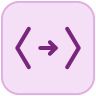

# Patterns and Matching

You already know `match`: Chapter 6 paired it with enums and showed why it's usually the right replacement for `switch`. This chapter isn't a rerun of that. It's about PHP's other pattern-shaped tool, one that gets far less attention than it deserves: destructuring, the art of pulling several values out of an array in one assignment instead of fetching them one at a time.

Destructuring and `match` don't look much alike on the page, but they're solving related problems. Both are about taking a shape you have (an array, a value that could be one of several things) and pulling structure out of it directly, rather than writing out the indexing or comparison logic by hand. Once you've used destructuring for a while, reaching into an array with `$row[0]`, `$row[1]`, `$row[2]` on three separate lines starts to feel as dated as a `switch` statement with six `break`s.

We'll survey the places destructuring shows up (plain assignment, `foreach`, skipped elements), then go deeper on the array syntax itself, including nested and keyed destructuring, which is where it earns its keep in everyday code. We'll close with a few syntax details of `match` that Chapter 6 didn't have room for: multiple conditions per arm, and the fact that arms are full expressions, not just literals.

None of this is exotic PHP. It's ordinary, idiomatic code that you'll start reaching for constantly once it's in your hands: the kind of thing that makes code you write next week noticeably tidier than code you wrote last week.
